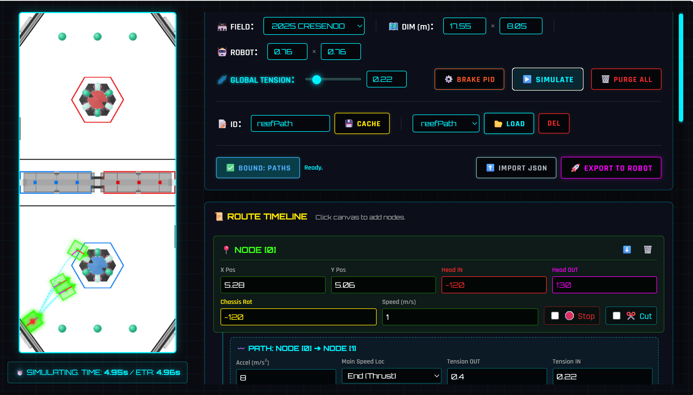

# 🌌 Pass Planner | User-unfriendly Highly-customizable Light-weight Low-key FRC Path Generation Tool

 <!-- 💡 替换为你的网页截图路径 -->

Welcome to the **Pass Planner** repository! This project represents a modern, data-driven, and highly decoupled software architecture for FIRST Robotics Competition (FRC). 

We have successfully separated the "Tactical Brain" (Trajectory Generation & Targeting) from the "Physical Muscle" (Phoenix 6 Hardware Control), resulting in a zero-configuration, highly robust Autonomous system.

> **🌊 2025 Reefscape Ready, Future-Proofed for Anything**
> The current logic and examples in this repository (such as the dynamic Reef routing) are specifically tailored for the **2025 FRC game, REEFSCAPE**. However, the core Pass Planner engine is incredibly highly-customizable. You can easily swap out the field background, coordinate arrays, and targeting math to adapt this tool for any future FRC game!

## ✨ Core Philosophy: The MVC Architecture
Instead of dumping math and logic into the drivetrain, this project strictly follows a decoupled design:
* **The Muscle (`CommandSwerveDrivetrain`)**: 100% native code generated by CTRE Phoenix Tuner X. Pure hardware control, zero tactical hardcoding. 
* **The Brain (`PassPlanner`)**: A standalone tactical engine injected via Setter Injection. Handles topology math, Blue-Alliance coordinate mapping, and dynamic Bezier curve generation.
* **The Blueprint (JSON + `Autos`)**: Autonomous paths are drawn externally and loaded as pure data.

---

## 🚀 Key Features

### 1. Offline HTML Trajectory Tool (Monorepo)
Included in the `tools/` folder is **PassPlanner.html**, a lightweight, fully offline web application used to draw multi-segment Bezier curves. 
* Visually plot your path on the field map.
* Export JSON files directly into the robot's `src/main/deploy/paths` directory (yeah you need to create a folder called paths).
* Version-controlled together with the robot code to ensure absolute synchronization.

### 2. Universal Absolute Mapping (Blue Universe)
No more writing separate autos for Red and Blue! The `PassPlanner` engine features a **Universal Coordinate Folder**:
* Automatically detects Alliance Color.
* Projects Red Alliance robot coordinates mathematically into the Blue Alliance universe.
* Preserves real physical momentum and inertia (Field-Centric velocity vectoring) when generating dynamic takeover paths.

### 3. Dynamic Reef Takeover
Calculates the absolute shortest topological distance to any of the 6 Reef faces. If the robot is interrupted or pushed, the engine dynamically generates a 3rd-order Bezier curve (with momentum preservation and 45° corner-cutting) to securely latch onto the target.

### 4. Zero-Config Smart Autonomous
The `RobotContainer` features a smart `refreshAutoMode()` loop running during `disabledPeriodic()`.
* Automatically detects the robot's physical starting position on the field (Left vs. Right).
* Automatically reads the Alliance color.
* **Preloads** the exact trajectory from JSON before the match even starts, preventing loop overruns and CPU spikes during the Auto init phase.

### 5. The Motion Execution Suite (`AutoMove`)
While `PassPlanner` acts as the brain, we've built a modular suite of commands to act as the central nervous system. You can string these together to build anything from simple movements to complex routines:
* **`AutoMoveComplex`**: The heavyweight champion. It reads the JSON paths generated by the Pass Planner tool and executes multi-segment Bezier curves flawlessly.
* **`AutoMoveCircle`**: Dynamically generates and executes circular arcs for smooth cornering or obstacle avoidance.
* **`AutoMoveOpen` / `AutoMoveClosed`**: Lightweight, highly customizable primitives for pure coordinate-to-coordinate driving. Perfect for creating simpler, on-the-fly paths without needing a full JSON file!

---

## 🎥 Simulation Showcase

Watch the Pass Planner brain and the `AutoMove` suite in action within the WPILib / AdvantageScope simulation environment!

### 🤖 Autonomous Execution
*(The robot executing a preloaded JSON trajectory perfectly parsed from the PassPlanner tool)*

<video src="tools/auto_sim.mp4" width="100%" controls autoplay loop muted></video>

### 🎮 Manual / Dynamic Takeover
*(Dynamic routing, on-the-fly Reef targeting, and momentum preservation during Teleop)*

<video src="tools/manual_sim.mp4" width="100%" controls autoplay loop muted></video>

---

## 📂 Repository Structure

```text
2026_FRC_Project/
├── .git/                      
├── src/main/
│   ├── deploy/paths           <-- Generated JSON path files live here
│   └── java/frc/robot/
│       ├── commands/          <-- Autos.java & AutoMove commands (Data-driven assembly line)
│       ├── subsystems/        <-- CommandSwerveDrivetrain.java (Native Tuner X)
│       └── utils/             <-- PassPlanner.java & PassPlannerReader.java (The Tactical Brain)                 
│         
└── README.md